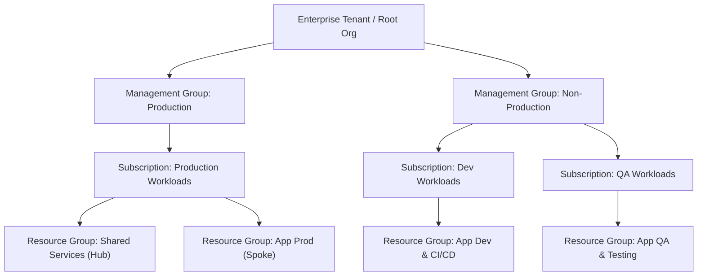
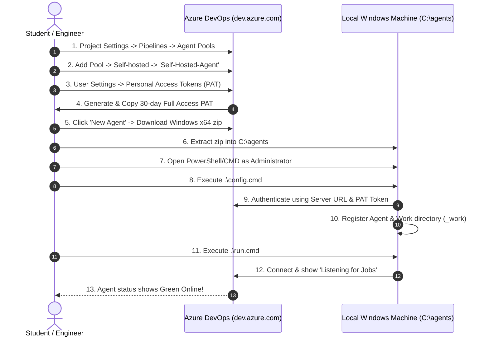

# Project 5: Azure DevOps CI/CD, Multi-Cloud Architecture & Self-Hosted Runner Deployment

[](README.md)
[](README.md)
[](README.md)
[](README.md)

---
> [🏠 Master Learning Index](README.md) | [📖 All Summaries](README.md)
---

## 📋 Table of Contents

1. [Session Overview & Agenda](#1-session-overview--agenda)
2. [Multi-Cloud Strategy & Market Share Breakdown](#2-multi-cloud-strategy--market-share-breakdown)
3. [Why Companies Choose Specific Cloud Providers](#3-why-companies-choose-specific-cloud-providers)
4. [Azure Portal vs Azure DevOps: Core Architectural Differences](#4-azure-portal-vs-azure-devops-core-architectural-differences)
5. [Integrating Azure Portal and Azure DevOps via Service Connections](#5-integrating-azure-portal-and-azure-devops-via-service-connections)
6. [Top 10 Core Services: Deep Dive & Multi-Cloud Comparison](#6-top-10-core-services-deep-dive--multi-cloud-comparison)
   - [6.1 Virtual Machines (Azure VM vs AWS EC2 vs GCP GCE)](#61-virtual-machines-azure-vm-vs-aws-ec2-vs-gcp-gce)
   - [6.2 Object Storage (Azure Blob vs AWS S3 vs GCP Cloud Storage)](#62-object-storage-azure-blob-vs-aws-s3-vs-gcp-cloud-storage)
   - [6.3 Relational Databases (Azure SQL/MySQL vs AWS RDS vs GCP Cloud SQL)](#63-relational-databases-azure-sqlmysql-vs-aws-rds-vs-gcp-cloud-sql)
   - [6.4 Identity & Directory Management (Microsoft Entra ID / AD vs AWS IAM vs GCP IAM)](#64-identity--directory-management-microsoft-entra-id--ad-vs-aws-iam-vs-gcp-iam)
   - [6.5 Isolated Networking (Azure VNet vs AWS VPC vs GCP VPC)](#65-isolated-networking-azure-vnet-vs-aws-vpc-vs-gcp-vpc)
   - [6.6 Managed Kubernetes (Azure AKS vs AWS EKS vs GCP GKE)](#66-managed-kubernetes-azure-aks-vs-aws-eks-vs-gcp-gke)
   - [6.7 Load Balancing & Ingress (Azure Load Balancer & Application Gateway vs AWS ALB/NLB vs GCP Load Balancing)](#67-load-balancing--ingress-azure-load-balancer--application-gateway-vs-aws-albnlb-vs-gcp-load-balancing)
   - [6.8 Message Queuing & Event Streaming (Azure Service Bus/Queue vs AWS SQS/SNS vs GCP Pub/Sub)](#68-message-queuing--event-streaming-azure-service-busqueue-vs-aws-sqssns-vs-gcp-pubsub)
   - [6.9 Centralized Monitoring & Observability (Azure Monitor vs CloudWatch vs GCP Monitoring vs Prometheus/Grafana)](#69-centralized-monitoring--observability-azure-monitor-vs-cloudwatch-vs-gcp-monitoring-vs-prometheusgrafana)
   - [6.10 Serverless Compute (Azure Functions vs AWS Lambda vs GCP Cloud Functions)](#610-serverless-compute-azure-functions-vs-aws-lambda-vs-gcp-cloud-functions)
7. [GCP 10 Services Recap & Real-World Use Cases](#7-gcp-10-services-recap--real-world-use-cases)
8. [Enterprise Cloud Architecture: The Landing Zone Concept](#8-enterprise-cloud-architecture-the-landing-zone-concept)
9. [Project 5 Application Architecture: React YouTube Clone](#9-project-5-application-architecture-react-youtube-clone)
10. [Azure Web App (App Service - PaaS) vs IaaS Virtual Machines](#10-azure-web-app-app-service---paas-vs-iaas-virtual-machines)
11. [Why Self-Hosted Pipeline Runners Are Required](#11-why-self-hosted-pipeline-runners-are-required)
12. [Step-by-Step Hands-On Guide: Setting Up a Self-Hosted Windows Agent](#12-step-by-step-hands-on-guide-setting-up-a-self-hosted-windows-agent)
    - [12.1 Navigate to Azure DevOps & Project Settings](#121-navigate-to-azure-devops--project-settings)
    - [12.2 Create a New Agent Pool](#122-create-a-new-agent-pool)
    - [12.3 Download the Windows x64 Agent Package](#123-download-the-windows-x64-agent-package)
    - [12.4 Setup System Directory Structure (`C:\agents`)](#124-setup-system-directory-structure-cagents)
    - [12.5 Generate a Personal Access Token (PAT)](#125-generate-a-personal-access-token-pat)
    - [12.6 Configure the Agent (`config.cmd`)](#126-configure-the-agent-configcmd)
    - [12.7 Run and Verify the Agent Listener (`run.cmd`)](#127-run-and-verify-the-agent-listener-runcmd)
13. [Pipeline Monitoring vs Production Observability](#13-pipeline-monitoring-vs-production-observability)
14. [Interview Speaking Strategy: The 30+ LPA Storytelling Framework](#14-interview-speaking-strategy-the-30-lpa-storytelling-framework)
15. [Real-World Enterprise Case Studies Discussed in Session](#15-real-world-enterprise-case-studies-discussed-in-session)
    - [15.1 PwC Banking Security & Monitoring Case Study](#151-pwc-banking-security--monitoring-case-study)
    - [15.2 TCS Enterprise Single Sign-On (SSO) with Active Directory](#152-tcs-enterprise-single-sign-on-sso-with-active-directory)
    - [15.3 High-Volume Payroll Processing with Message Queues](#153-high-volume-payroll-processing-with-message-queues)
    - [15.4 Banking Document & Image Processing with Azure Functions](#154-banking-document--image-processing-with-azure-functions)
    - [15.5 BigQuery Batch Data Export with GCP Cloud Functions](#155-bigquery-batch-data-export-with-gcp-cloud-functions)
16. [Common Issues, Errors & Troubleshooting Matrix](#16-common-issues-errors--troubleshooting-matrix)
17. [Project Summary in One Page](#17-project-summary-in-one-page)
18. [Summary of All Batch 44 Capstone Projects](#18-summary-of-all-batch-44-capstone-projects)
19. [Top 10 Technical Interview Questions & Answers](#19-top-10-technical-interview-questions--answers)
20. [Top 10 Scenario-Based Interview Questions & Solutions](#20-top-10-scenario-based-interview-questions--solutions)

---

## 1. Session Overview & Agenda

This session marks the transition into **Microsoft Azure and Azure DevOps CI/CD automation** for Batch-44. The session is structured into three major parts:

```text
+-----------------------------------------------------------------------------+
|                               SESSION ROADMAP                               |
+-----------------------------------------------------------------------------+
|  PART 1: Multi-Cloud Comparison (AWS vs Azure vs GCP vs OCI)               |
|          • Market share breakdown                                           |
|          • Top 10 services comparison & enterprise use cases                 |
|          • Turning theoretical definitions into 30+ LPA interview stories   |
+-----------------------------------------------------------------------------+
|  PART 2: Enterprise Cloud Architecture & Concepts                           |
|          • Landing Zone hierarchy & multi-subscription governance           |
|          • Azure Portal (Cloud Hosting) vs Azure DevOps (ALM / CI/CD)       |
|          • Integration via Service Connections (SC)                         |
|          • Azure Web Apps (PaaS) vs Virtual Machines (IaaS)                 |
+-----------------------------------------------------------------------------+
|  PART 3: Project 5 Hands-On Implementation                                  |
|          • React-based YouTube Clone application code structure             |
|          • Overcoming free-tier limits with Self-Hosted Agents              |
|          • End-to-end setup of Windows Agent Runner (C:\agents)             |
|          • PAT authentication, config.cmd & run.cmd execution               |
+-----------------------------------------------------------------------------+
```

---

## 2. Multi-Cloud Strategy & Market Share Breakdown

The session emphasized that modern DevOps engineers cannot rely solely on AWS. Being skilled across multiple clouds significantly increases job market competitiveness.

```text
+-------------------------------------------------------------------+
|                     GLOBAL CLOUD MARKET SHARE                     |
+-------------------------------------------------------------------+
|  AWS (Amazon Web Services)        ~ 30-32%                        |
|  Microsoft Azure                  ~ 28-30%                        |
|  Google Cloud Platform (GCP)      ~ 10-12%                        |
|  Oracle Cloud (OCI) & Others      ~ 10-15%                        |
+-------------------------------------------------------------------+
```

### Why Learn Multiple Clouds?
1. **Broader Job Opportunities:** Even if an initial interview is conducted for AWS, internal client projects frequently require Azure or GCP.
2. **Same Underlying Concepts:** Cloud computing fundamentals—Compute, Storage, Networking, Identity, and Containerization—are identical across all providers. Only portal interfaces, CLI syntax, and service naming conventions differ.
3. **Multi-Cloud Architecture:** Enterprise clients often adopt a multi-cloud strategy to avoid vendor lock-in, optimize licensing, and leverage best-of-breed specialized services.

---

## 3. Why Companies Choose Specific Cloud Providers

During the session, students analyzed why enterprises choose one cloud provider over another:

- **Microsoft Azure:**
  - Highly preferred for organizations migrating existing **.NET applications**, Windows Server environments, SQL Server databases, and Microsoft enterprise software licenses.
  - Native integration with Microsoft 365 and Microsoft Entra ID (formerly Azure Active Directory).
- **Google Cloud Platform (GCP):**
  - Preferred for data analytics (BigQuery), machine learning, and container orchestration.
  - Since **Kubernetes was originally designed and open-sourced by Google**, Google Kubernetes Engine (GKE) provides the most mature, developer-friendly managed Kubernetes platform.
- **Amazon Web Services (AWS):**
  - First-mover advantage, broadest service catalog, vast global footprint, and mature enterprise ecosystem.
- **Oracle Cloud (OCI):**
  - Optimal choice for legacy enterprise database workloads where organizations already hold substantial Oracle database licenses and ERP systems.

---

## 4. Azure Portal vs Azure DevOps: Core Architectural Differences

One of the key technical distinctions covered in the session is that **Azure Portal** and **Azure DevOps** are two distinct, independent platforms:

```text
+------------------------------------------+    +------------------------------------------+
|               AZURE PORTAL               |    |               AZURE DEVOPS               |
|          (portal.azure.com)              |    |      (dev.azure.com / aex.dev.azure.com) |
+------------------------------------------+    +------------------------------------------+
| • Cloud Hosting Platform                 |    | • Application Lifecycle Management (ALM) |
| • Provides 200+ Cloud Services           |    | • Azure Boards (Work Items / Sprints)    |
| • Compute (VMs, App Services, Functions) |    | • Azure Repos (Git Source Repositories)  |
| • Storage & Databases (Blob, MySQL, SQL) |    | • Azure Pipelines (CI/CD YAML Automation)|
| • Virtual Networks (VNets, Gateways)     |    | • Azure Artifacts (Package Management)   |
| • Cloud Monitoring (Azure Monitor)       |    | • Azure Test Plans (QA Testing Suite)    |
| • Where applications RUN                 |    | • Where code is BUILT, TESTED & DEPLOYED |
+------------------------------------------+    +------------------------------------------+
```

---

## 5. Integrating Azure Portal and Azure DevOps via Service Connections

Because Azure Portal and Azure DevOps operate as independent platforms, they require a secure mechanism to communicate.

```text
+---------------------+                            +---------------------+
|    Azure DevOps     |   ==== Service Connection ===>  |    Azure Portal     |
|   (Azure Pipeline)  |        (Service Principal) |  (App Service/WebApp)   |
+---------------------+                            +---------------------+
```

### Key Integration Takeaways:
- **How do they integrate?** Through a **Service Connection (SC)**.
- **Underlying Mechanism:** A Service Connection provisions an **Azure Active Directory (Entra ID) Service Principal** with role-based access (e.g., Contributor) to specific subscriptions or Resource Groups.
- **Clarifications from Session:**
  - *Is it an API?* An API is too generic of an answer.
  - *Is it Microsoft Entra ID alone?* Entra ID handles authentication/identity; the integration itself is configured as a Service Connection.

---

## 6. Top 10 Core Services: Deep Dive & Multi-Cloud Comparison

During the interactive session, the instructor conducted an in-depth review of the top 10 foundational cloud services across AWS, Azure, and GCP, transforming basic definitions into senior-level interview explanations:

---

### 6.1 Virtual Machines (Azure VM vs AWS EC2 vs GCP GCE)
- **Concept:** Infrastructure as a Service (IaaS) on-demand virtualized computing power running Linux or Windows.
- **Service Mapping:**
  - AWS: **Amazon EC2**
  - Azure: **Azure Virtual Machines (VM)**
  - GCP: **Compute Engine (GCE)**
- **Real-World Use Cases:**
  - Running monolithic backend servers.
  - Running self-hosted CI/CD automation runners (Jenkins, GitLab runners, Azure DevOps agents).
  - Executing administrative cron jobs, batch maintenance scripts, and Linux admin tasks.

---

### 6.2 Object Storage (Azure Blob vs AWS S3 vs GCP Cloud Storage)
- **Concept:** Massively scalable, highly available storage for unstructured objects accessed over HTTP/HTTPS APIs.
- **Service Mapping:**
  - AWS: **Amazon S3**
  - Azure: **Azure Blob Storage**
  - GCP: **Cloud Storage (GCS)**
- **Real-World Use Cases:**
  - Storing user-uploaded files, photos, and streaming video files.
  - Database snapshot backups and application log archives.
  - Virtually unlimited total capacity with tiered lifecycle storage (Hot, Cool, Archive).

---

### 6.3 Relational Databases (Azure SQL/MySQL vs AWS RDS vs GCP Cloud SQL)
- **Concept:** Fully managed relational database services (PaaS) built on popular database engines (MySQL, PostgreSQL, Microsoft SQL Server, Oracle).
- **Service Mapping:**
  - AWS: **Amazon RDS / Aurora**
  - Azure: **Azure SQL Database / Azure Database for MySQL**
  - GCP: **Cloud SQL**
- **Core Benefits:**
  - Automates OS patching, database version upgrades, point-in-time automated backups, high availability, and scaling.
  - Eliminates manual database server administration.

---

### 6.4 Identity & Directory Management (Microsoft Entra ID / AD vs AWS IAM vs GCP IAM)
- **Concept:** Centralized identity authentication, Single Sign-On (SSO), and role-based access control (RBAC).
- **Service Mapping:**
  - AWS: **AWS IAM / IAM Identity Center**
  - Azure: **Microsoft Entra ID (Azure Active Directory)**
  - GCP: **Cloud IAM**
- **Enterprise Use Case (TCS Example):**
  - When an employee joins a company (e.g., TCS), IT creates a single corporate email ID and adds it to the Active Directory group.
  - Using Single Sign-On (SSO), the employee logs into all internal portals, cloud environments, and internal applications without creating separate usernames and passwords for each system.

---

### 6.5 Isolated Networking (Azure VNet vs AWS VPC vs GCP VPC)
- **Concept:** Isolated, software-defined private cloud network boundary where cloud resources securely reside.
- **Service Mapping:**
  - AWS: **Amazon VPC (Virtual Private Cloud)**
  - Azure: **Azure Virtual Network (VNet)**
  - GCP: **VPC Network**
- **Core Architecture:**
  - Subnet segregation (Public subnets for load balancers; Private subnets for application workloads and databases).
  - Network Security Groups (NSGs) and firewall rules controlling ingress/egress traffic.

---

### 6.6 Managed Kubernetes (Azure AKS vs AWS EKS vs GCP GKE)
- **Concept:** Managed Kubernetes control planes that orchestrate containerized microservices.
- **Service Mapping:**
  - AWS: **Amazon EKS (Elastic Kubernetes Service)**
  - Azure: **Azure Kubernetes Service (AKS)**
  - GCP: **Google Kubernetes Engine (GKE)**
- **Key Takeaways from Session:**
  - How to check cluster nodes? `kubectl get nodes`.
  - The `kubectl` CLI utility operates identically across AKS, EKS, and GKE—the underlying Kubernetes API is 100% standard open source.
  - Cloud providers only manage the underlying control plane infrastructure.

---

### 6.7 Load Balancing & Ingress (Azure Load Balancer & Application Gateway vs AWS ALB/NLB vs GCP Load Balancing)
- **Concept:** Distributing network and application traffic across pools of backend compute resources.
- **Service Mapping & Differences:**
  - **Layer 4 Load Balancer (Azure Load Balancer / AWS NLB):** Operates at Transport Layer (TCP/UDP), ultra-low latency, packet-level distribution.
  - **Layer 7 Load Balancer (Azure Application Gateway / AWS ALB):** Operates at Application Layer (HTTP/HTTPS), supports cookie-based session affinity, URL path routing (e.g., `/api` vs `/images`), SSL termination, and integrated Web Application Firewall (WAF).
- **Session Scenario:** Enforcing user authentication at a public gateway URL before allowing direct access to backend video files or course content.

---

### 6.8 Message Queuing & Event Streaming (Azure Service Bus/Queue vs AWS SQS/SNS vs GCP Pub/Sub)
- **Concept:** Asynchronous, decoupled messaging buffer between producer and consumer services.
- **Service Mapping:**
  - AWS: **Amazon SQS / SNS**
  - Azure: **Azure Queue Storage / Azure Service Bus**
  - GCP: **Cloud Pub/Sub**
  - Open Source: **RabbitMQ, Apache Kafka**
- **Key Concepts:**
  - **FIFO (First In, First Out):** Ensures strict sequential order of processing.
  - **Dead Letter Queue (DLQ):** Captures failed or unparseable messages for auditing and reprocessing without halting the pipeline.
  - **Topics & Subscriptions:** Routes messages to specific consumer groups based on subscription filters.

---

### 6.9 Centralized Monitoring & Observability (Azure Monitor vs CloudWatch vs GCP Monitoring vs Prometheus/Grafana)
- **Concept:** Centralized collection, analysis, and alerting on logs, performance metrics, and application traces.
- **Service Mapping:**
  - AWS: **Amazon CloudWatch**
  - Azure: **Azure Monitor & Log Analytics Workspaces**
  - GCP: **Cloud Monitoring (formerly Stackdriver)**
  - Open Source: **Prometheus & Grafana**
- **Key Trade-offs Discussed in Session:**
  - *Why use native cloud monitoring in banking?* Prevents sensitive customer data from exiting cloud boundaries to external SaaS tools; eliminates the need to manage dedicated monitoring VMs.
  - *Why use Prometheus/Grafana in Kubernetes?* Handles high-churn ephemeral container metrics without incurring massive per-metric cloud ingestion costs.

---

### 6.10 Serverless Compute (Azure Functions vs AWS Lambda vs GCP Cloud Functions)
- **Concept:** Event-driven serverless computing where code runs on-demand in response to events and automatically scales to zero when idle.
- **Service Mapping:**
  - AWS: **AWS Lambda**
  - Azure: **Azure Functions**
  - GCP: **Cloud Functions**
- **Real-World Use Cases:**
  - Automated image/document resizing upon upload.
  - Running short periodic batch exports (running 4 minutes daily without maintaining a 24/7 VM).
  - Database cleanup triggers and webhook integrations.

---

## 7. GCP 10 Services Recap & Real-World Use Cases

The session reviewed the Google Cloud Platform equivalent services and associated interview stories:

```text
+-----------------------+-----------------------------+-------------------------------------------------+
| GCP Service           | Core Capability             | Real-World Use Case Discussed in Session        |
+-----------------------+-----------------------------+-------------------------------------------------+
| Compute Engine (GCE)  | IaaS Virtual Machines       | Hosting automation scripts, backup cron jobs.   |
| Cloud Storage (GCS)   | Unlimited Object Storage    | Storing application backups & media assets.     |
| Cloud SQL             | Managed MySQL / PostgreSQL  | Migrating on-premise Oracle/MySQL DBs to cloud. |
| Cloud Pub/Sub         | Asynchronous Messaging      | Decoupling e-commerce order status updates.     |
| Google K8s Engine(GKE)| Managed Kubernetes          | Production container orchestration for microapps|
| Cloud Functions       | Event-Driven Serverless     | 4-minute daily BigQuery batch data export.      |
| Cloud IAM             | Identity & RBAC             | Role-based user and service account permissions.|
| VPC Network           | Isolated Cloud Networking   | Network isolation with subnets & firewall rules |
| Cloud Load Balancing  | Global Traffic Distribution | Distributing global HTTP/S traffic across zones |
| Cloud Monitoring      | Centralized Telemetry       | Compliant in-cloud monitoring for banking data. |
+-----------------------+-----------------------------+-------------------------------------------------+
```

---

## 8. Enterprise Cloud Architecture: The Landing Zone Concept

During project onboarding, cloud architects design and deploy an **Azure Landing Zone** (or AWS Control Tower) before developers start deploying code:



### Core Characteristics of a Landing Zone:
1. **Multi-Subscription Separation:** Isolates environments (Dev, QA, Stage, Production) into dedicated subscriptions to prevent noisy neighbors and limit blast radius.
2. **Hub-and-Spoke Topology:** Central hub hosts shared networking (Firewall, VPN Gateway), peered with spoke workload virtual networks.
3. **Billing Governance:** Enables department-level cost tracking and consolidated billing with enterprise enterprise discounts.
4. **Boilerplate Automation:** Standardized environment baseline provisioned automatically for new project teams.

---

## 9. Project 5 Application Architecture: React YouTube Clone

The hands-on project focuses on building an automated CI/CD pipeline for a modern **React-based YouTube Clone Application**:

```text
React YouTube Clone App (Source Code in Git)
       |
       v
  npm install        --> Installs Node.js dependencies
       |
       v
  npm run build      --> Compiles production bundle (HTML, JS, CSS)
       |
       v
  build/ Artifacts   --> Production-ready static web bundle
       |
       v
  Azure Web App      --> Deployed securely over HTTPS
```

---

## 10. Azure Web App (App Service - PaaS) vs IaaS Virtual Machines

During the session, students discussed whether to host the React application on an Azure Virtual Machine or an Azure Web App:

| Feature | Azure Virtual Machine (IaaS) | Azure Web App / App Service (PaaS) |
| :--- | :--- | :--- |
| **Server Provisioning** | Manual OS setup & configuration required | Instant pre-configured runtime environment |
| **Runtime / Node.js** | Must be installed & upgraded manually | Managed and patched automatically by Azure |
| **Web Server (Nginx)** | Manual installation & config files | Managed natively by Azure App Service |
| **Security & OS Patches**| User responsibility | Microsoft responsibility |
| **SSL / HTTPS** | Manual certbot / TLS configuration | Free built-in managed SSL certificates |
| **Deployment Flow** | SSH / Ansible / Manual artifact copy | Native CI/CD deployment via Service Connection |

> **Conclusion:** Azure Web App (PaaS) is the modern industry standard for hosting web applications, eliminating operating system maintenance overhead.

---

## 11. Why Self-Hosted Pipeline Runners Are Required

To execute an Azure DevOps CI/CD pipeline (running `npm install`, `npm run build`, testing, and artifact deployment), compute capacity is required.

Azure DevOps provides two runner options:

```text
                             AZURE PIPELINE RUNNERS
                                       |
              +------------------------+------------------------+
              |                                                 |
              v                                                 v
  [ MICROSOFT-HOSTED AGENTS ]                       [ SELF-HOSTED AGENTS ]
  • Hosted in Microsoft Cloud                       • Installed on your local machine or VM
  • Requires paid parallel job license              • 100% Free of cost on any account
  • Fails on free accounts with registration error  • Complete control over tools & caching
  • No access to private on-prem networks           • Direct access to local & private resources
```

> [!IMPORTANT]
> Free-tier Azure DevOps accounts do not include free Microsoft-hosted parallel execution credits. Attempting to use Managed DevOps Pools results in registration errors. Configuring a **Self-Hosted Agent** provides a dedicated, free, and unrestricted CI/CD execution runner.

---

## 12. Step-by-Step Hands-On Guide: Setting Up a Self-Hosted Windows Agent

The following step-by-step procedure documents the complete practical configuration demonstrated during the session.



---

### 12.1 Navigate to Azure DevOps & Project Settings
1. Open your browser and navigate to `https://dev.azure.com/<your-organization>` (or `https://aex.dev.azure.com`).
2. Open your project (e.g., `DevOps-Batch-44`).
3. Click on **Project Settings** at the bottom-left corner of the page.

---

### 12.2 Create a New Agent Pool
1. In the **Project Settings** sidebar, navigate to **Pipelines** -> **Agent Pools**.
2. Click the **Add pool** button in the top-right corner.
3. In the configuration modal:
   - **Pool to link:** `[New]`
   - **Pool type:** `Self-hosted`
   - **Name:** `Self-Hosted-Agent` (or custom name e.g., `My-Agent-Pool`)
   - **Grant access permission to all pipelines:** Check this box (required for pipelines to access the agent).
4. Click **Create**.

---

### 12.3 Download the Windows x64 Agent Package
1. Click on your newly created pool (`Self-Hosted-Agent`).
2. Click on the **New Agent** button.
3. In the popup modal, select the **Windows** tab and choose **x64**.
4. Click **Download** to save the compressed archive (approx. 273 MB, e.g., `vsts-agent-win-x64-3.xxx.x.zip`).

---

### 12.4 Setup System Directory Structure (`C:\agents`)
To prevent Windows path-length errors and maintain production standards:

1. Open File Explorer and navigate to the `C:\` root directory.
2. Create a new folder named `agents` (`C:\agents`).
3. Move the downloaded `.zip` file from your `Downloads` folder into `C:\agents`.
4. Extract the contents of the zip file directly inside `C:\agents`.

```powershell
# Directory verification
cd C:\agents
ls
# Confirm config.cmd, run.cmd, and bin/ are present
```

---

### 12.5 Generate a Personal Access Token (PAT)
The agent software requires authentication credentials to register with your Azure DevOps organization:

1. In the top-right header of Azure DevOps, click the **User Settings** icon (gear icon with person, next to your profile picture).
2. Select **Personal Access Tokens**.
3. Click **+ New Token**.
4. Configure the token parameters:
   - **Name:** `my-agent-pat`
   - **Organization:** Select your organization
   - **Expiration:** `30 days`
   - **Scopes:** Select `Full access` (or custom with *Agent Pools: Read & Manage*).
5. Click **Create**.
6. **Copy the generated PAT token immediately** and save it temporarily in Notepad (it will not be shown again).

---

### 12.6 Configure the Agent (`config.cmd`)
1. Open **Command Prompt** or **PowerShell** as **Administrator**.
2. Navigate to your agent directory:
   ```cmd
   cd C:\agents
   ```
3. Run the configuration script:
   ```cmd
   .\config.cmd
   ```
4. Respond to the interactive prompts:
   - **Enter server URL:** `https://dev.azure.com/<your-organization-name>` *(e.g., `https://dev.azure.com/AjayJena86`)*
   - **Enter authentication type (press enter for PAT):** Press `Enter`
   - **Enter personal access token:** Paste your copied PAT token and press `Enter`
   - **Enter agent pool (press enter for default):** Type `Self-Hosted-Agent` and press `Enter`
   - **Enter agent name:** `MyLaptopAgent` (or custom name)
   - **Enter work folder (press enter for _work):** Press `Enter`
   - **Enter run agent as service? (Y/N):** Press `Y` (or `N` for interactive runner)
   - **Enter enable SERVICE_SID_TYPE_UNRESTRICTED? (Y/N):** Press `Y`

---

### 12.7 Run and Verify the Agent Listener (`run.cmd`)
1. In the Administrator terminal, start the agent listener:
   ```cmd
   .\run.cmd
   ```
2. Observe the terminal output:
   ```text
   Scanning for tool capabilities...
   Connecting to the server...
   2026-09-02 11:30:00Z: Listening for Jobs
   ```
3. Verify in the Azure DevOps Portal:
   - Go to **Project Settings** -> **Agent Pools** -> **Self-Hosted-Agent** -> **Agents**.
   - Your agent (`MyLaptopAgent`) will display a **Green Online Status**!

```text
+-----------------------------------------------------------------------+
|  AGENT STATUS IN AZURE DEVOPS:                                        |
|  [● ONLINE] MyLaptopAgent (Version 3.xxx.x, Enabled, Idle)             |
+-----------------------------------------------------------------------+
```

---

## 13. Pipeline Monitoring vs Production Observability

During the session, students debated whether CI/CD pipelines require external observability tools like Prometheus or Datadog:

### Why CI/CD Pipelines Do NOT Need External Observability:
1. **Built-in Real-Time Feedback:** Pipelines are ephemeral batch automation jobs. Azure Pipelines provides real-time streaming console logs, step execution timers, and historical run logs natively.
2. **Automated Alerts:** Developers receive automated email, Slack, or Microsoft Teams notifications when a build succeeds or fails.
3. **Direct Root Cause Identification:** When a pipeline fails, developers inspect the console output directly in Azure DevOps to identify the exact line where `npm install` or compilation failed.

### When External Monitoring IS Required:
- For **24/7 Production Systems** (Virtual Machines, Kubernetes Pods, Databases, Network Gateways) to track ongoing health metrics: CPU/Memory utilization, HTTP error rates, Latency, and Disk saturation.

---

## 14. Interview Speaking Strategy: The 30+ LPA Storytelling Framework

The instructor highlighted a crucial interview gap: many engineers understand technical concepts but fail interviews because they provide flat, generic definitions.

To crack senior-level DevOps roles (30+ LPA), responses must follow the **4-Step Enterprise Storytelling Framework**:

```text
+-------------------------------------------------------------------------+
|                  THE 4-PART SENIOR DEVOPS ANSWER MODEL                  |
+-------------------------------------------------------------------------+
|  1. CONTEXT     : "In my previous project at PwC/TCS/Client..."         |
|  2. CHALLENGE   : "We observed high costs / security restrictions / ..."|
|  3. SOLUTION    : "We architected and implemented [Specific Tool]..."   |
|  4. IMPACT      : "This reduced latency by 40% / ensured compliance..." |
+-------------------------------------------------------------------------+
```

---

## 15. Real-World Enterprise Case Studies Discussed in Session

---

### 15.1 PwC Banking Security & Monitoring Case Study
- **Background:** At PwC, banking application servers were hosted in an isolated cloud environment.
- **Problem:** Attempting to export raw virtual machine and database logs to external third-party observability tools (like Splunk SaaS) caused security firewalls to block 10–30% of logs containing sensitive customer data. Additionally, self-hosting Prometheus/Grafana required dedicated VMs, maintenance overhead, and a 24/7 on-call team.
- **Solution:** Configured native **Azure Monitor & Log Analytics Workspaces**, keeping all telemetry strictly contained within the client's compliant cloud perimeter with zero external data egress.

---

### 15.2 TCS Enterprise Single Sign-On (SSO) with Active Directory
- **Background:** An enterprise organization like TCS has over 400,000 employees accessing hundreds of internal portals and cloud tools.
- **Problem:** Creating individual usernames, passwords, and access policies for every internal server creates massive administrative overhead and major security vulnerabilities upon employee offboarding.
- **Solution:** Implemented **Microsoft Entra ID (Azure Active Directory)** with centralized Single Sign-On (SSO) and group-based RBAC. When an employee is provisioned or offboarded, access across all 10+ environments is granted or revoked instantaneously.

---

### 15.3 High-Volume Payroll Processing with Message Queues
- **Background:** Processing monthly salary distribution for 400,000 employees across multiple banking networks.
- **Problem:** Sending 400,000 synchronous API requests to banking gateways causes immediate connection timeouts, rate limiting, and database crashes.
- **Solution:** Deployed an asynchronous queuing pipeline using **Azure Service Bus / SQS / Kafka**. The payroll generator pushes batches into queues; background worker pools process transactions sequentially with Dead Letter Queues (DLQ) capturing any failed transactions for automatic retry.

---

### 15.4 Banking Document & Image Processing with Azure Functions
- **Background:** Retail banking loan application system where thousands of customers upload scanned identity documents and photos via mobile devices.
- **Problem:** Customer photo uploads range from 5MB to 15MB in uncompressed formats (PNG/JPEG), causing extreme processing latency on backend servers. Running dedicated 24/7 VMs for occasional image processing is cost-inefficient.
- **Solution:** Created an event-driven **Azure Function** triggered whenever an image is uploaded to Blob Storage. The serverless function compresses/resizes the image within 200ms and stores the optimized copy for downstream processing, scaling to zero when idle.

---

### 15.5 BigQuery Batch Data Export with GCP Cloud Functions
- **Background:** An analytics data export feature pulls reporting metrics from BigQuery and formats downloadable reports.
- **Problem:** The export routine runs for only 4–10 minutes once every 24 hours. Provisioning a dedicated VM requires paying for 24 hours of idle compute and managing OS patches.
- **Solution:** Implemented **GCP Cloud Functions** that trigger on a scheduled cron event, execute the data extraction query for 4 minutes, export the file, and terminate, reducing compute costs by over 95%.

---

## 16. Common Issues, Errors & Troubleshooting Matrix

| Issue / Error Encountered | Root Cause | Exact Resolution Discussed in Session |
| :--- | :--- | :--- |
| **`Managed DevOps Pool Registration Error`** | Free-tier Azure accounts do not have complimentary Microsoft-hosted agent capacity. | Create and configure a **Self-Hosted Agent Pool** on your local machine / VM. |
| **`404 Not Found` when loading `dev.azure.com`** | Direct URL missing organization path or directory context. | Navigate via `https://aex.dev.azure.com` to select the active Azure DevOps organization. |
| **`TF400813: Unauthorized` during `config.cmd`** | Expired, mistyped, or insufficient PAT token permissions. | Generate a new PAT with **Full Access** (or *Agent Pools: Read & Manage*) and 30-day validity. |
| **`PathTooLongException` during Agent Extraction** | Extracting zip deep within `C:\Users\...\Downloads\`. | Move the archive directly to `C:\agents` and extract in the root path. |
| **Agent shows `Offline` status in Portal** | The terminal running `run.cmd` was closed or service stopped. | Re-open Administrator terminal and execute `C:\agents\run.cmd` (or start the Windows Service). |
| **Cross-Project Pipeline Cannot Access Agent** | Agent pool access restricted to a single project. | Under **Project Settings** -> **Agent Pools**, enable **"Grant access permission to all pipelines"**. |

---

## 17. Project Summary in One Page

```text
===============================================================================
PROJECT 5: AZURE DEVOPS CI/CD & MULTI-CLOUD INFRASTRUCTURE AUTOMATION
===============================================================================
• Application        : React.js YouTube Clone Single Page Application
• Version Control    : Azure Repos (Git) / GitHub Mirror
• CI/CD Platform     : Azure DevOps (dev.azure.com / aex.dev.azure.com)
• Execution Engine   : Self-Hosted Windows Pipeline Agent (C:\agents)
• Hosting Target     : Azure Web App (App Service - PaaS)
• Integration Model  : Azure Service Connection (Azure AD Service Principal)

EXECUTION WORKFLOW:
  1. Developer pushes React source code to Azure Repos.
  2. Azure Pipeline triggers automatically upon Git push.
  3. Job is dispatched to Self-Hosted Agent Pool ('Self-Hosted-Agent').
  4. Local Agent ('MyLaptopAgent') picks up job: runs 'npm install' & 'npm run build'.
  5. Build artifacts are packaged and deployed to Azure Web App via Service Connection.
  6. Application is live online with managed HTTPS and auto-scaling.
===============================================================================
```

---

## 18. Summary of All Batch 44 Capstone Projects

During the session, students reviewed the progression across all major batch capstone projects:

```text
+--------------+------------------------------------+-----------------------------------------------+
| Project      | Technology Stack                   | Core Implementation                           |
+--------------+------------------------------------+-----------------------------------------------+
| Project 1    | Java, Jenkins, SonarQube, Maven    | Java Spring Boot CI with Quality Gates        |
| Project 2    | Kubernetes, Microservices, GKE     | Polyglot 10+ Microservices E-Commerce on GKE  |
| Project 3    | Terraform, AWS, 3-Tier Architecture| 40 AWS resources (VPC, ASG, ALB, RDS MySQL)   |
| Project 5    | Azure DevOps, React, Web Apps, PaaS| Self-Hosted Runners, CI/CD, Azure App Service |
+--------------+------------------------------------+-----------------------------------------------+
```

---

## 19. Top 10 Technical Interview Questions & Answers

### Q1: What is the fundamental difference between Azure Portal and Azure DevOps?
**Answer:** Azure Portal (`portal.azure.com`) is Microsoft's cloud hosting management console used to provision and operate IaaS/PaaS infrastructure (VMs, VNets, Databases, Web Apps). Azure DevOps (`dev.azure.com`) is a complete Application Lifecycle Management (ALM) suite providing developer collaboration tools (Boards, Repos, Pipelines, Test Plans, and Artifacts feeds). They integrate via Service Connections using Azure AD Service Principals.

---

### Q2: Why would an enterprise choose a Self-Hosted Agent over a Microsoft-Hosted Agent?
**Answer:**
1. **Cost Optimization:** Free accounts can execute unlimited pipeline jobs on self-hosted infrastructure without purchasing parallel job licenses.
2. **Private Network Connectivity:** Self-hosted agents deployed inside private VNets can access private databases, internal registries, and on-premises environments without public ingress.
3. **Custom Pre-installed Tooling:** Enables custom caching, specialized SDKs, build dependencies, and Docker engines pre-warmed on the host.

---

### Q3: What is a Personal Access Token (PAT) in Azure DevOps, and where is it utilized?
**Answer:** A PAT is an alternate password token generated by an Azure DevOps user to authenticate external tools, CLIs, Git commands, and pipeline runners securely without exposing corporate AD passwords. In our project, it is used during `config.cmd` execution to authenticate the self-hosted agent with the Azure DevOps agent pool.

---

### Q4: How does Azure App Service (Web App) differ from an Azure Virtual Machine for hosting web apps?
**Answer:** Azure VM is an IaaS solution requiring the engineer to manage OS patching, web server installation (Nginx/Apache), security updates, and runtime versions. Azure App Service is a fully managed PaaS platform where Microsoft handles the underlying infrastructure, OS patching, and load balancing, allowing engineers to focus solely on deploying code/artifacts with built-in HTTPS and deployment slots.

---

### Q5: What is an Azure Landing Zone, and why is it essential for enterprise migrations?
**Answer:** An Azure Landing Zone is an architected, multi-subscription environment foundation following cloud adoption frameworks. It provides centralized identity (Entra ID), standardized Hub-and-Spoke networking, security guardrails (Azure Policies), and segregated subscriptions (Dev, QA, Prod) with consolidated billing before application workloads are deployed.

---

### Q6: What are the equivalents of AWS S3 and GCP Cloud Storage in Microsoft Azure?
**Answer:** The Azure equivalent is **Azure Blob Storage** within an Azure Storage Account. It provides highly scalable, durable object storage for unstructured data (images, media, logs, backups) across hot, cool, cold, and archive access tiers.

---

### Q7: Explain the difference between Azure Load Balancer and Azure Application Gateway.
**Answer:**
- **Azure Load Balancer:** Operates at **Layer 4 (Transport Layer - TCP/UDP)**, providing high-throughput, low-latency load balancing across backend VM pools.
- **Azure Application Gateway:** Operates at **Layer 7 (Application Layer - HTTP/HTTPS)**, supporting URL path-based routing, cookie session affinity, SSL termination, and integrated Web Application Firewall (WAF) rules.

---

### Q8: How does Azure Kubernetes Service (AKS) compare with Amazon EKS and Google GKE?
**Answer:** All three are managed Kubernetes platforms providing a cloud-managed control plane while worker nodes run on cloud VMs. Developers interact with all three using identical `kubectl` commands. GKE is historically the most mature in automated upgrades; AKS offers deep integration with Entra ID and Azure Active Directory RBAC; EKS is tightly integrated with AWS IAM and VPC CNI.

---

### Q9: Why is external pipeline monitoring (e.g., Prometheus) generally unnecessary for CI/CD runs?
**Answer:** CI/CD pipelines are transient batch processes rather than long-running services. Azure Pipelines natively provides step-by-step console streaming, detailed error logs, timing metrics, and automated failure notifications. External monitoring like Prometheus is reserved for 24/7 production workloads (VMs, Pods, DBs).

---

### Q10: How does Azure Functions compare to AWS Lambda and GCP Cloud Functions?
**Answer:** All three represent serverless Function-as-a-Service (FaaS) computing. They execute event-driven code in response to triggers (HTTP requests, queue messages, blob uploads) and automatically scale down to zero when idle, eliminating idle server costs.

---

## 20. Top 10 Scenario-Based Interview Questions & Solutions

### Scenario 1: Self-Hosted Agent Fails with `TF400813: The user is not authorized to access this resource`
**Scenario:** You execute `.\config.cmd` on your Windows host, provide the PAT, but receive an authorization error.
**Solution:**
1. Verify that the user who generated the PAT has Administrator privileges on the target Agent Pool.
2. In Azure DevOps, generate a new PAT with the **Agent Pools: Read & Manage** scope (or Full Access).
3. Ensure the organization URL format is strictly `https://dev.azure.com/<organization-name>`.

---

### Scenario 2: Pipeline Fails with `No agent found in pool Self-Hosted-Agent which satisfies demand`
**Scenario:** A newly created YAML pipeline hangs and fails because no matching agent can be located.
**Solution:**
1. Verify that `C:\agents\run.cmd` is actively running and displaying `Listening for Jobs`.
2. Inspect the YAML pipeline `pool:` block to ensure the name matches your agent pool name exactly:
   ```yaml
   pool:
     name: 'Self-Hosted-Agent'
   ```
3. Ensure the agent pool has **"Grant access permission to all pipelines"** toggled on under Project Settings.

---

### Scenario 3: Bank Compliance Prohibits Exporting Logs to Third-Party Observability Vendors
**Scenario:** Your client operates in the financial domain and strictly forbids sending telemetry to Datadog or Splunk Cloud. How do you design monitoring?
**Solution:**
1. Implement native **Azure Monitor and Log Analytics Workspaces** contained strictly inside the client's Azure tenant.
2. Configure diagnostic settings on all VNets, Web Apps, VMs, and Databases to route telemetry exclusively into private Log Analytics workspaces without external internet routing.

---

### Scenario 4: Managing High-Volume Asynchronous Transaction Processing
**Scenario:** An e-commerce module receives 50,000 order requests per minute during flash sales that overwhelm the backend inventory database.
**Solution:**
1. Decouple the frontend order-taking API from the backend database using **Azure Service Bus Queues** (or AWS SQS / GCP Pub/Sub).
2. The web tier enqueues order messages instantly; worker services process orders from the queue at a steady rate with **Dead Letter Queues (DLQ)** configured for failed transactions.

---

### Scenario 5: Free-Tier Azure DevOps Fails When Creating Managed DevOps Pools
**Scenario:** A student or junior engineer attempts to run an Azure Pipeline but encounters billing/concurrency errors on Microsoft-hosted agents.
**Solution:**
1. Do not attempt to use Microsoft-hosted agents on free accounts without purchasing parallel job grants.
2. Switch to a **Self-Hosted Runner**: Download the agent binaries to a local machine/VM, register it under an agent pool, and execute pipelines locally for free.

---

### Scenario 6: Moving from Monolithic VM Deployments to Cloud PaaS
**Scenario:** An engineering team spends 15 hours weekly manually patching Ubuntu servers hosting React/Node.js web apps. How do you modernize this?
**Solution:**
1. Migrate the application from IaaS VMs to **Azure App Service (Web App)**.
2. Setup automated CI/CD via Azure DevOps Pipelines to push compiled build artifacts directly to App Service via a Service Connection, eliminating all OS and runtime maintenance.

---

### Scenario 7: Corporate Multi-Cloud Strategy Across AWS and Azure
**Scenario:** A company runs its core legacy .NET ERP on Azure and its containerized microservices on AWS. How do you structure identity and deployment?
**Solution:**
1. Integrate **Microsoft Entra ID (Azure AD)** as the primary Identity Provider (IdP) with SAML 2.0 federation to AWS IAM for unified Single Sign-On (SSO).
2. Utilize Azure DevOps as the centralized CI/CD platform, using dedicated Service Connections to deploy to both Azure and AWS environments.

---

### Scenario 8: Long File Path Errors During Windows Agent Extraction
**Scenario:** Extracting the agent archive into `C:\Users\Username\Downloads\...\` fails with Windows `PathTooLongException`.
**Solution:**
1. Never extract agent binaries inside deeply nested user folders.
2. Create a clean root directory such as `C:\agents` and extract the `.zip` directly into that location.

---

### Scenario 9: Zero-Downtime Releases for Production Web Apps
**Scenario:** Deploying a new release of a web application causes a 2-minute service outage while files are updated.
**Solution:**
1. Enable **Deployment Slots** (Staging & Production) in Azure App Service.
2. Configure the Azure DevOps Release Pipeline to deploy new artifacts into the **Staging Slot**, perform automated health verification, and execute a zero-downtime **Slot Swap** with Production.

---

### Scenario 10: Ensuring Self-Hosted Agent Persistence Across System Reboots
**Scenario:** The developer's machine restarts overnight, causing morning build pipelines to fail because the agent is offline.
**Solution:**
1. Open PowerShell as Administrator in `C:\agents`.
2. Stop the interactive runner and install the agent as a background Windows Service:
   ```cmd
   .\config.cmd --runAsService
   ```
3. Set the service startup type to **Automatic** in `services.msc` so the agent starts up immediately on boot without requiring a user login.
