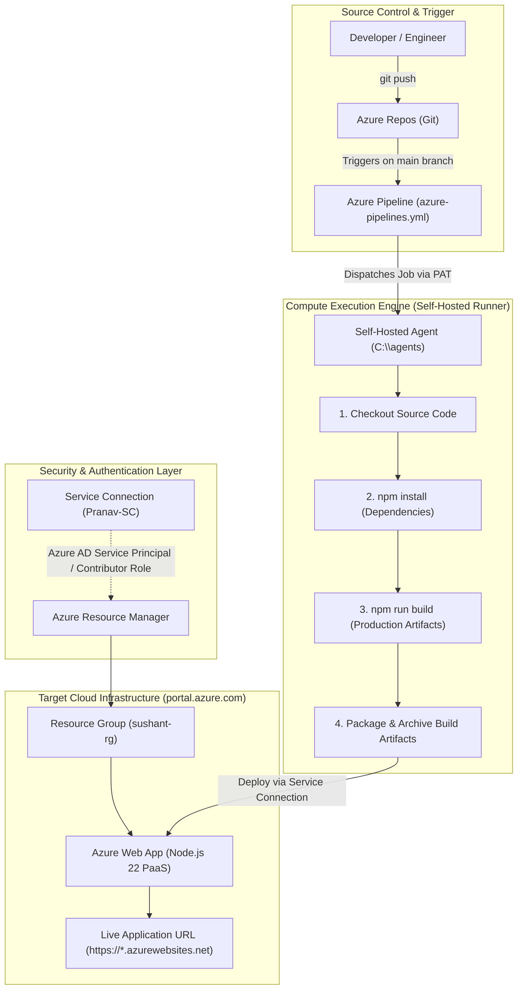
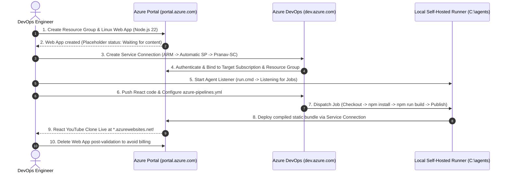
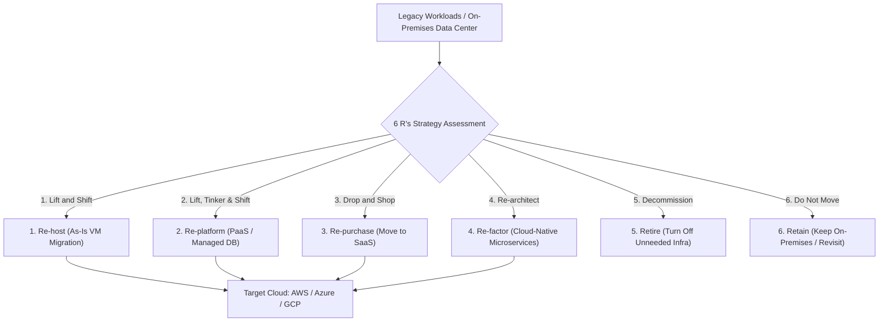
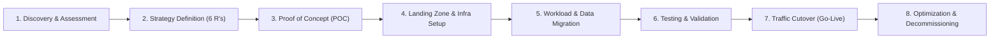

# Project 5 (Part 2): Azure DevOps CI/CD Pipeline Automation, Web App (PaaS) Deployment & Enterprise Cloud Migration

[](README.md)
[](README.md)
[](README.md)
[-0089D6?style=for-the-badge&logo=microsoft-azure&logoColor=white)](README.md)
[](README.md)

---
> [🏠 Master Learning Index](README.md) | [📖 All Summaries](README.md)
---

## 📋 Table of Contents

1. [Session Overview & Agenda](#1-session-overview--agenda)
2. [End-to-End Architecture: Azure DevOps CI/CD to Azure Web App](#2-end-to-end-architecture-azure-devops-cicd-to-azure-web-app)
3. [Component Breakdown & Role Separation](#3-component-breakdown--role-separation)
   - [3.1 Developer vs DevOps Engineer Responsibilities](#31-developer-vs-devops-engineer-responsibilities)
   - [3.2 Azure Portal vs Azure DevOps vs Self-Hosted Runner](#32-azure-portal-vs-azure-devops-vs-self-hosted-runner)
4. [Step-by-Step Hands-On Implementation Guide](#4-step-by-step-hands-on-implementation-guide)
   - [4.1 Step 1: Azure Web App (App Service - PaaS) Creation on Azure Portal](#41-step-1-azure-web-app-app-service---paas-creation-on-azure-portal)
   - [4.2 Step 2: Creating Azure Service Connection in Azure DevOps](#42-step-2-creating-azure-service-connection-in-azure-devops)
   - [4.3 Step 3: Pushing Source Code to Azure Repos](#43-step-3-pushing-source-code-to-azure-repos)
   - [4.4 Step 4: Starting the Self-Hosted Windows Agent Runner](#44-step-4-starting-the-self-hosted-windows-agent-runner)
   - [4.5 Step 5: Authoring the Azure DevOps Pipeline YAML (`azure-pipelines.yml`)](#45-step-5-authoring-the-azure-devops-pipeline-yaml-azure-pipelinesyml)
   - [4.6 Step 6: Pipeline Execution, Step Logs & Runner Telemetry](#46-step-6-pipeline-execution-step-logs--runner-telemetry)
   - [4.7 Step 7: Live Verification & Fault-Tolerance Testing](#47-step-7-live-verification--fault-tolerance-testing)
5. [Deep Dive: Azure DevOps Pipeline YAML Task Analysis](#5-deep-dive-azure-devops-pipeline-yaml-task-analysis)
6. [Runner Deployment Architecture: Local Laptop vs Cloud VM vs Microsoft-Hosted](#6-runner-deployment-architecture-local-laptop-vs-cloud-vm-vs-microsoft-hosted)
7. [Enterprise Cloud Migration Strategies (The 6 R's Framework)](#7-enterprise-cloud-migration-strategies-the-6-rs-framework)
   - [7.1 What is Cloud Migration?](#71-what-is-cloud-migration)
   - [7.2 Real-World Migration Examples from Batch 44 Projects](#72-real-world-migration-examples-from-batch-44-projects)
   - [7.3 The 6 R's Migration Strategies Breakdown](#73-the-6-rs-migration-strategies-breakdown)
   - [7.4 Enterprise Migration Lifecycle & Execution Steps](#74-enterprise-migration-lifecycle--execution-steps)
   - [7.5 Cloud Migration Tools & Acceleration Programs](#75-cloud-migration-tools--acceleration-programs)
   - [7.6 Real-World Case Study: IBM MQ to Azure Service Bus Modernization](#76-real-world-case-study-ibm-mq-to-azure-service-bus-modernization)
8. [Resource Cleanup & Cloud Cost Management](#8-resource-cleanup--cloud-cost-management)
9. [Project Summary in One Page](#9-project-summary-in-one-page)
10. [Common Issues, Error Codes & Troubleshooting Matrix](#10-common-issues-error-codes--troubleshooting-matrix)
11. [Top 10 Technical Interview Questions & Answers](#11-top-10-technical-interview-questions--answers)
12. [Top 10 Scenario-Based Interview Questions & Solutions](#12-top-10-scenario-based-interview-questions--solutions)

---

## 1. Session Overview & Agenda

This session represents **Part 2 of Project 5 (Azure DevOps CI/CD Automation)** for Batch-44. Building upon the self-hosted agent configuration established in Part 1, this session executes the end-to-end automation pipeline to build and deploy a modern **React YouTube Clone** web application to **Azure App Service (Web App - PaaS)**, followed by an in-depth exploration of **Enterprise Cloud Migration Strategies (The 6 R's Framework)**.

```text
+-----------------------------------------------------------------------------+
|                            SESSION 2 ROADMAP                                |
+-----------------------------------------------------------------------------+
|  PART 1: Azure App Service (PaaS) Provisioning                              |
|          • Creating Linux-based Web App on Azure Portal (Node.js 22 runtime)|
|          • Resource Group segregation and Azure subscription linking        |
|          • Verification of initial default placeholder URL                  |
+-----------------------------------------------------------------------------+
|  PART 2: Secure Platform Integration via Service Connections                |
|          • Linking Azure DevOps with Azure Resource Manager (ARM)           |
|          • Automated Azure AD Service Principal provisioning & RBAC scopes  |
|          • Granting unrestricted pipeline access permissions                |
+-----------------------------------------------------------------------------+
|  PART 3: CI/CD Pipeline YAML Development & Deployment Execution             |
|          • React source code checkout from Azure Repos                      |
|          • Local runner execution: 'npm install' & 'npm run build'          |
|          • Artifact packaging and automated deployment to Azure Web App     |
|          • Live verification & HTTP 503/403 failure testing                 |
+-----------------------------------------------------------------------------+
|  PART 4: Enterprise Cloud Migration Strategies (The 6 R's)                  |
|          • Re-host, Re-platform, Re-purchase, Re-factor, Retire, Retain     |
|          • 8-stage migration lifecycle (Discovery -> Assessment -> Cutover) |
|          • AWS DMS / Azure Migrate / MAP acceleration programs              |
|          • Real enterprise case study: IBM MQ to Azure Service Bus          |
+-----------------------------------------------------------------------------+
```

---

## 2. End-to-End Architecture: Azure DevOps CI/CD to Azure Web App

The following diagram illustrates the end-to-end system topology implemented during the hands-on session:



---

## 3. Component Breakdown & Role Separation

### 3.1 Developer vs DevOps Engineer Responsibilities

During the session, clear boundaries were defined between developer tasks and DevOps automation tasks:

```text
+-------------------------------------------------------------------------+
|                  RESPONSIBILITY BOUNDARY IN REAL TEAMS                  |
+-------------------------------------------------------------------------+
|  DEVELOPER RESPONSIBILITIES:                                            |
|  • Writes React / Node.js frontend and backend application code.        |
|  • Defines package dependencies in 'package.json'.                      |
|  • Executes local Git workflow: 'git init', 'git add', 'git commit'.    |
|  • Pushes feature branches / PRs to Azure Repos.                        |
+-------------------------------------------------------------------------+
|  DEVOPS ENGINEER RESPONSIBILITIES:                                      |
|  • Provisions cloud runtime infrastructure (Azure Web App, RG, VNet).   |
|  • Establishes Azure Service Connections and RBAC permissions.          |
|  • Configures and maintains CI/CD runners (Self-Hosted / VM pools).     |
|  • Authors declarative 'azure-pipelines.yml' build & deploy pipelines.  |
|  • Monitors pipeline health, resolves build breaks, and manages cleanup.|
+-------------------------------------------------------------------------+
```

### 3.2 Azure Portal vs Azure DevOps vs Self-Hosted Runner

| Platform Component | Primary Purpose | Key Responsibilities | Access URL / Path |
| :--- | :--- | :--- | :--- |
| **Azure Portal** | Cloud Infrastructure & Hosting | Hosts App Services, Resource Groups, Virtual Networks, Databases, Storage Accounts. | `portal.azure.com` |
| **Azure DevOps** | Application Lifecycle Management | Manages Git repositories (Repos), CI/CD pipelines (Pipelines), and Sprint boards (Boards). | `dev.azure.com` / `aex.dev.azure.com` |
| **Self-Hosted Runner** | Pipeline Execution Engine | Provides compute capacity (CPU, RAM, GPU, Disk) to execute `npm install`, build compilation, and deployment tasks. | Local machine / VM (`C:\agents`) |
| **Service Connection** | Integration & Security Gateway | Authenticates Azure DevOps Pipelines to Azure Portal via Azure Active Directory Service Principal. | Project Settings -> Service Connections |

---

## 4. Step-by-Step Hands-On Implementation Guide



---

### 4.1 Step 1: Azure Web App (App Service - PaaS) Creation on Azure Portal

1. Log into the **Azure Portal** at `https://portal.azure.com`.
2. In the top search bar, search for **Web App** (select *Web App* from the Marketplace; do not select Static Web App).
3. Click **+ Create** -> **Web App**.
4. Configure the **Basics** tab:
   - **Subscription:** Select your active billing subscription.
   - **Resource Group:** Click *Create new* -> enter `sushant-rg` (or unique name).
   - **Name:** Enter a globally unique web app name (e.g., `youtube-application-prod` or `javed-youtube-app`). The default URL will be `https://<app-name>.azurewebsites.net`.
   - **Publish:** Select `Code`.
   - **Runtime Stack:** Select `Node 22 LTS` (React runs on the Node.js runtime).
   - **Operating System:** Select `Linux` (recommended for faster boot times, lower resource overhead, and cost efficiency).
   - **Region:** Select your nearest region (e.g., `West US 2` or `East US`).
   - **Pricing Plan (App Service Plan):** Select the default Linux plan.
5. Click **Review + Create**, then click **Create**.
6. Wait ~30 seconds for resource deployment to complete.
7. Click **Go to resource** and copy the **Default domain** URL.
8. Open the URL in a browser tab. It will display the default Microsoft Azure placeholder:
   ```text
   +----------------------------------------------------------------------+
   |  Microsoft Azure App Service                                         |
   |  Your web app is running and waiting for your content                |
   +----------------------------------------------------------------------+
   ```

---

### 4.2 Step 2: Creating Azure Service Connection in Azure DevOps

To enable Azure Pipelines to deploy artifacts into the newly created Web App, a secure **Service Connection** is required:

1. Log into **Azure DevOps** at `https://aex.dev.azure.com` or `https://dev.azure.com/<your-org>`.
2. Open your project (e.g., `DevOps-Batch-44` or `Roshan-Project-127`).
3. Click on **Project Settings** (bottom-left gear icon).
4. Under the **Pipelines** category, click **Service connections**.
5. Click **New service connection** (top-right).
6. Select **Azure Resource Manager** and click **Next**.
7. Select **Service principal (automatic)** and click **Next**.
8. Authenticate with your Azure Portal credentials:
   - **Scope level:** `Subscription`
   - **Subscription:** Select the active Azure subscription containing your Web App.
   - **Resource group:** Select `sushant-rg` (must match the resource group created in Step 1).
   - **Service connection name:** Enter `Pranav-SC` (or custom name, e.g., `AzureAppService-SC`).
   - **Security:** Check the box **"Grant access permission to all pipelines"** (CRITICAL: prevents pipeline builds from pausing for manual authorization).
9. Click **Save**. Azure DevOps automatically provisions an **Azure AD (Entra ID) Service Principal** with *Contributor* role permissions on the selected Resource Group.

---

### 4.3 Step 3: Pushing Source Code to Azure Repos

If the React application source code is not yet in Azure Repos:

```bash
# 1. Initialize local Git repository inside React project folder
cd /path/to/react-youtube-clone
git init

# 2. Stage all project files
git add .

# 3. Commit staged files
git commit -m "Initial commit: React YouTube Clone application source code"

# 4. Link to Azure Repos remote URL
git remote add origin https://<org-name>@dev.azure.com/<org-name>/<project-name>/_git/<repo-name>

# 5. Push code to the main branch
git push -u origin main
```

---

### 4.4 Step 4: Starting the Self-Hosted Windows Agent Runner

1. Open **PowerShell** or **Command Prompt** as **Administrator**.
2. Navigate to your local agent installation folder:
   ```cmd
   cd C:\agents
   ```
3. Launch the agent listener:
   ```cmd
   .\run.cmd
   ```
4. Confirm the terminal output displays:
   ```text
   Scanning for tool capabilities...
   Connecting to the server...
   2026-09-03 06:15:32Z: Listening for Jobs
   ```
5. In Azure DevOps, go to **Project Settings** -> **Agent Pools** -> **Self-Hosted-Agent** -> **Agents** tab and verify the agent status displays **Online** (Green).

> [!NOTE]
> If you encounter an error stating *"The session of the agent already exists"*, wait 30–60 seconds. The agent will automatically retry, terminate the orphaned session, and reconnect.

---

### 4.5 Step 5: Authoring the Azure DevOps Pipeline YAML (`azure-pipelines.yml`)

1. In Azure DevOps, navigate to **Pipelines** -> **Pipelines** -> click **New Pipeline**.
2. Select **Azure Repos Git** -> choose your repository.
3. Select **Starter pipeline** or **Node.js**, replace the contents with the following production pipeline definition, and customize the parameter values:

```yaml
# ==============================================================================
# Azure DevOps CI/CD Pipeline: React YouTube Clone to Azure App Service (PaaS)
# ==============================================================================

trigger:
  branches:
    include:
      - main

pool:
  name: 'Self-Hosted-Agent'   # Name of your Self-Hosted Agent Pool configured in ADO

variables:
  azureSubscriptionServiceConnection: 'Pranav-SC'        # Exact Service Connection name
  webAppName: 'javed-youtube-app'                         # Exact Azure Web App name
  environmentName: 'Production'

stages:
- stage: BuildAndDeploy
  displayName: 'Build and Deploy React Application'
  jobs:
  - job: BuildJob
    displayName: 'Compile, Package and Deploy'
    steps:

    # Step 1: Checkout Git Source Code
    - checkout: self
      displayName: 'Checkout Application Source Code'

    # Step 2: Install Node.js Dependencies
    - script: |
        echo "Installing Node.js npm dependencies..."
        npm install
      displayName: 'npm install (Dependencies)'

    # Step 3: Build Production Bundle
    - script: |
        echo "Compiling production React bundle..."
        npm run build
      displayName: 'npm run build (Compile React Bundle)'

    # Step 4: Archive Compiled Build Artifacts
    - task: ArchiveFiles@2
      displayName: 'Archive Build Directory'
      inputs:
        rootFolderOrFile: '$(System.DefaultWorkingDirectory)/build'
        includeRootFolder: false
        archiveType: 'zip'
        archiveFile: '$(Build.ArtifactStagingDirectory)/$(Build.BuildId).zip'
        replaceExistingArchive: true

    # Step 5: Publish Build Artifacts to Pipeline Container
    - task: PublishBuildArtifacts@1
      displayName: 'Publish Pipeline Artifacts'
      inputs:
        PathtoPublish: '$(Build.ArtifactStagingDirectory)/$(Build.BuildId).zip'
        ArtifactName: 'drop'
        publishLocation: 'Container'

    # Step 6: Deploy Artifact Zip to Azure Web App (PaaS)
    - task: AzureWebApp@1
      displayName: 'Deploy to Azure App Service'
      inputs:
        azureSubscription: '$(azureSubscriptionServiceConnection)'
        appType: 'webAppLinux'
        appName: '$(webAppName)'
        package: '$(Build.ArtifactStagingDirectory)/$(Build.BuildId).zip'
```

---

### 4.6 Step 6: Pipeline Execution, Step Logs & Runner Telemetry

1. Click **Save and run**.
2. Commit directly to the `main` branch with the commit message `Setup CI/CD for React YouTube App on Azure Web App`.
3. Open the running build job (e.g., *Job #27*) and observe the live streaming console logs:

```text
==============================================================================
Starting: Checkout Application Source Code
==============================================================================
Syncing repository: DevOps-Batch-44 (Git)
Prepending PATH environment variable with directory containing 'git.exe'...
git version 2.43.0.windows.1
git clone --depth 1 https://dev.azure.com/CloudDevOpsHub/DevOps-Batch-44/_git/youtube-clone
Cloning into 'C:\agents\_work\1\s'...
Finishing: Checkout Application Source Code

==============================================================================
Starting: npm install (Dependencies)
==============================================================================
> react-youtube-clone@1.0.0
> added 1420 packages in 24s
Finishing: npm install (Dependencies)

==============================================================================
Starting: npm run build (Compile React Bundle)
==============================================================================
> react-youtube-clone@1.0.0 build
> react-scripts build
Creating an optimized production build...
Compiled successfully.
File sizes after gzip:
  142.85 kB  build/static/js/main.d4e680a1.js
  28.12 kB   build/static/css/main.8e932b10.css
The build folder is ready to be deployed.
Finishing: npm run build (Compile React Bundle)

==============================================================================
Starting: Deploy to Azure App Service
==============================================================================
Got service connection details for Azure App Service: 'Pranav-SC'
Package deployment using Kudu ZipDeploy started.
Deploying $(Build.ArtifactStagingDirectory)/27.zip to App Service: javed-youtube-app
Successfully deployed web application to Azure App Service.
App Service Application URL: https://javed-youtube-app.azurewebsites.net
Finishing: Deploy to Azure App Service
```

#### Local Runner System Telemetry Observed During Build:
During `npm install` and `npm run build`, open **Windows Task Manager**:
- **CPU & RAM:** Significant spike as the Node.js V8 engine parses dependencies and compiles React JSX into minified JavaScript bundles.
- **Network / Wi-Fi:** Spike during initial package downloading; drops to near zero once packages are cached.
- **Disk I/O:** High throughput writes in `C:\agents\_work\1\s\node_modules` and `C:\agents\_work\1\s\build`.

---

### 4.7 Step 7: Live Verification & Fault-Tolerance Testing

1. Open your browser and refresh the Web App URL (`https://<app-name>.azurewebsites.net`).
2. **Success:** The React YouTube Clone application is live, displaying the video streaming grid, navigation bar, and active search interface.
3. **Failure Simulation Test (Stopping Web App):**
   - Go to **Azure Portal** -> **App Services** -> Open your Web App -> Click **Stop**.
   - Open a new incognito window and visit the URL.
   - The browser returns **HTTP 403 Forbidden** or **HTTP 503 Service Unavailable** (*Client/Server Error: The web app is stopped*).
4. **Recovery Test:**
   - In Azure Portal, click **Start**.
   - Refresh the browser tab -> The application recovers instantly.

---

## 5. Deep Dive: Azure DevOps Pipeline YAML Task Analysis

```text
+------------------------------------+--------------------------------------------------------------------+
| YAML Task / Keyword                | Technical Function & Execution Context                             |
+------------------------------------+--------------------------------------------------------------------+
| trigger: [ main ]                  | Automates Continuous Integration (CI). Every Git push to 'main'     |
|                                    | automatically invokes a new pipeline run.                          |
+------------------------------------+--------------------------------------------------------------------+
| pool: name: 'Self-Hosted-Agent'   | Dispatches the job to your local machine runner instead of the     |
|                                    | paid Microsoft-Hosted pool.                                        |
+------------------------------------+--------------------------------------------------------------------+
| checkout: self                     | Clones the repository into the runner's workspace directory        |
|                                    | ('C:\agents\_work\1\s').                                           |
+------------------------------------+--------------------------------------------------------------------+
| script: npm install                | Downloads all third-party libraries defined in 'package.json' into |
|                                    | the local 'node_modules' folder.                                   |
+------------------------------------+--------------------------------------------------------------------+
| script: npm run build              | Compiles React JSX components, static CSS, and assets into an      |
|                                    | optimized production build directory ('build/').                   |
+------------------------------------+--------------------------------------------------------------------+
| ArchiveFiles@2                     | Compresses the static 'build/' folder into a deployable '.zip'     |
|                                    | archive inside the runner's staging directory.                     |
+------------------------------------+--------------------------------------------------------------------+
| PublishBuildArtifacts@1            | Publishes the build zip as an immutable pipeline artifact container|
|                                    | ('drop') for auditing, versioning, and release traceability.       |
+------------------------------------+--------------------------------------------------------------------+
| AzureWebApp@1                      | Uses the Service Connection ('Pranav-SC') to push the zip package  |
|                                    | to Azure App Service via Kudu ZipDeploy over HTTPS.                |
+------------------------------------+--------------------------------------------------------------------+
```

---

## 6. Runner Deployment Architecture: Local Laptop vs Cloud VM vs Microsoft-Hosted

```text
+---------------------+-------------------------------+-------------------------------+-------------------------------+
| Feature / Metric    | Self-Hosted (Local Laptop)    | Self-Hosted (Cloud VM - IaaS) | Microsoft-Hosted Runner       |
+---------------------+-------------------------------+-------------------------------+-------------------------------+
| Hosting Location    | Student / Engineer Laptop     | AWS EC2 / Azure VM / GCP GCE  | Microsoft Azure Cloud Pool    |
| Compute Cost        | $0 (100% Free)                | Hourly VM compute charge      | Requires paid parallel license|
| Network Access      | Local network only            | Private Cloud VNet / VPC      | Public Internet only          |
| Build Speed         | High (Cached node_modules)    | High (Persistent disk cache)  | Slower (Clean VM each run)    |
| Tool Customization  | Full local administrator      | Full root/admin on VM         | Pre-defined toolset only      |
| Ideal Use Case      | Learning, labs, mini-projects | Enterprise team CI/CD pipelines| Simple open-source builds     |
+---------------------+-------------------------------+-------------------------------+-------------------------------+
```

---

## 7. Enterprise Cloud Migration Strategies (The 6 R's Framework)

During the second half of the session, students transitioned from application deployment to enterprise **Cloud Migration Architecture**.



---

### 7.1 What is Cloud Migration?

**Cloud Migration** is the process of transferring digital business operations, applications, databases, operating systems, storage, and IT infrastructure from legacy on-premises data centers to a public cloud provider (AWS, Azure, GCP), or between different cloud environments.

### 7.2 Real-World Migration Examples from Batch 44 Projects

Throughout the Batch-44 curriculum, students have already executed multiple real-world migrations:

1. **Operating System Migration (Project 3 - AWS Terraform):**
   - Migrated EC2 AMI baselines from outdated **Ubuntu 18.04** to modern **Ubuntu 22.04 LTS** in Terraform configuration without rebuilding the underlying network topology.
2. **Database Instance Class Migration (Project 3 - AWS RDS):**
   - Migrated Amazon RDS MySQL instance classes from **`db.t2.micro`** to **`db.t3.micro`** for enhanced burstable CPU credits and network performance.
3. **Application Architecture Migration (Project 2 - Kubernetes GKE):**
   - Migrated monolithic e-commerce applications into containerized polyglot microservices deployed on Google Kubernetes Engine (GKE).
4. **Content & Collaboration Migration:**
   - Migrating static documentation from Google Docs to Canva, or switching live classrooms from basic Zoom to an integrated Cloud LMS (Learning Management System).

---

### 7.3 The 6 R's Migration Strategies Breakdown

```text
+------------------+-----------------------+----------------------------------------------------+----------------------+
| Strategy (6 R's) | Industry Term         | Definition & Architectural Impact                  | Complexity & Effort  |
+------------------+-----------------------+----------------------------------------------------+----------------------+
| 1. Re-host       | Lift and Shift        | Moving applications/VMs to the cloud without code  | Low (Fastest ROI)    |
|                  |                       | or configuration changes.                          |                      |
+------------------+-----------------------+----------------------------------------------------+----------------------+
| 2. Re-platform   | Lift, Tinker & Shift  | Making minor optimizations (e.g., moving on-prem   | Medium               |
|                  |                       | DB to AWS RDS or web apps to Azure App Service)    |                      |
|                  |                       | without rewriting core application code.           |                      |
+------------------+-----------------------+----------------------------------------------------+----------------------+
| 3. Re-purchase   | Drop and Shop         | Replacing custom legacy software with modern       | Medium               |
|                  |                       | Commercial-Off-The-Shelf (COTS) SaaS products      |                      |
|                  |                       | (e.g., custom CRM -> Salesforce, custom HR -> Workday).|                  |
+------------------+-----------------------+----------------------------------------------------+----------------------+
| 4. Re-factor     | Re-architect          | Re-architecting and rebuilding the application from| Highest              |
|                  |                       | scratch using cloud-native services (Serverless,   | (6 months - 2 years) |
|                  |                       | Microservices, Service Bus, Containers).           |                      |
+------------------+-----------------------+----------------------------------------------------+----------------------+
| 5. Retire        | Decommission          | Identifying and decommissioning legacy applications| Lowest               |
|                  |                       | or idle servers that are no longer in active use.  | (Immediate savings)  |
+------------------+-----------------------+----------------------------------------------------+----------------------+
| 6. Retain        | Revisit / Do Nothing  | Retaining workloads in on-premise environments due | None                 |
|                  |                       | to compliance, data residency, or deprecation plans|                      |
+------------------+-----------------------+----------------------------------------------------+----------------------+
```

---

### 7.4 Enterprise Migration Lifecycle & Execution Steps

An enterprise cloud migration is never an overnight script execution. It spans **6 months to 2 years** across 8 rigorous phases:



1. **Discovery & Assessment:**
   - Inventorying all on-premises servers, application dependencies, network ports, databases, and resource utilization.
   - Appointing Subject Matter Experts (SMEs) to map application architecture.
2. **Strategy Definition:**
   - Mapping each application to one of the 6 R's based on business priority, cost, and complexity.
3. **Proof of Concept (POC):**
   - Testing a small, non-critical workload (e.g., internal staging app) on the target cloud to validate performance, security, and cost models.
4. **Landing Zone & Environment Setup:**
   - Establishing multi-subscription landing zones, VNets/VPCs, IAM RBAC, Azure Policies, and billing budgets.
5. **Workload & Data Migration:**
   - Executing continuous database replication and server image synchronization.
6. **Testing & Security Validation:**
   - Executing load testing, security audits, disaster recovery (DR) drills, and user acceptance testing (UAT).
7. **Traffic Cutover (Go-Live):**
   - Switching DNS records (e.g., Amazon Route 53 / Azure DNS) from on-prem to the new cloud endpoint during a scheduled maintenance window.
8. **Optimization & Decommissioning:**
   - Running parallel environments for 30–90 days for fallback safety, followed by complete physical server decommissioning and license cancellations.

---

### 7.5 Cloud Migration Tools & Acceleration Programs

```text
+-----------------------+-----------------------------------------------+-----------------------------------------------+
| Capability            | Amazon Web Services (AWS)                     | Microsoft Azure                               |
+-----------------------+-----------------------------------------------+-----------------------------------------------+
| Discovery & Inventory | AWS Application Discovery Service             | Azure Migrate: Discovery and Assessment       |
| Server Migration      | AWS Application Migration Service (AWS MGN)   | Azure Migrate: Server Migration               |
| Database Migration    | AWS Database Migration Service (AWS DMS)      | Azure Database Migration Service (Azure DMS)  |
| Data Transfer App     | AWS DataSync / Snowball                       | Azure Data Box / Storage Mover                |
| Enterprise Funding    | AWS Migration Acceleration Program (MAP)      | Azure Migration and Modernization Program(AMMP)|
+-----------------------+-----------------------------------------------+-----------------------------------------------+
```

---

### 7.6 Real-World Case Study: IBM MQ to Azure Service Bus Modernization

During the interactive session, a real-world enterprise scenario was analyzed:

- **Legacy Background:** A financial enterprise processed millions of retail transactions through on-premises **IBM MQ** message brokers.
- **Challenges:** Extremely high proprietary licensing fees, physical hardware maintenance, single points of failure, and inability to dynamically scale during festive sales.
- **Migration Strategy:** **Refactoring (Re-architecting)** to cloud-native **Azure Service Bus**.
- **Execution Timeline:** Took approximately **2 years** to redesign message producers/consumers, validate strict FIFO ordering, configure Dead Letter Queues (DLQs), achieve banking compliance approvals, and execute smooth traffic cutover.

---

## 8. Resource Cleanup & Cloud Cost Management

> [!CAUTION]
> Azure App Service (Web App) operates on a dedicated hourly compute billing model. To avoid unnecessary cloud charges against your student or trial subscription credits, delete the Web App immediately after completing your validation.

```powershell
# Option 1: Delete via Azure Portal GUI
# Navigate to Azure Portal -> App Services -> Select your Web App -> Click 'Delete' -> Confirm app name.

# Option 2: Delete via Azure CLI (Cloud Shell / PowerShell)
az webapp delete --name javed-youtube-app --resource-group sushant-rg

# Option 3: Delete Entire Resource Group (Removes Web App, Plan & Associated Telemetry)
az group delete --name sushant-rg --yes --no-wait
```

*Note: Azure DevOps organizations, Git repositories, pipeline YAML definitions, and local self-hosted agent files (`C:\agents`) are 100% free and do not incur ongoing cloud charges.*

---

## 9. Project 5 Summary in One Page

```text
========================================================================================================
PROJECT 5 (PART 2): COMPLETE AZURE DEVOPS CI/CD & ENTERPRISE CLOUD MIGRATION CHEATSHEET
========================================================================================================

1. APPLICATION DETAILS:
   • Application Stack  : React.js YouTube Clone (Single Page Application)
   • Source Code Host   : Azure Repos (Git) on 'main' branch
   • Build Automation   : Node.js 22, npm install, npm run build (produces static 'build/' folder)

2. CI/CD AUTOMATION INFRASTRUCTURE:
   • Platform Host      : Azure DevOps (dev.azure.com / aex.dev.azure.com)
   • Runner Engine      : Self-Hosted Windows Agent running at 'C:\agents' (authenticated via 30-day PAT)
   • Runner Command     : '.\run.cmd' executed with Administrator privileges
   • Platform Bridge    : Azure Service Connection ('Pranav-SC') backed by Azure AD Service Principal

3. TARGET HOSTING PLATFORM:
   • Cloud Provider     : Microsoft Azure (portal.azure.com)
   • Service Model      : Platform as a Service (PaaS) - Azure App Service / Web App (Linux)
   • Deployment Method  : AzureWebApp@1 task using Kudu ZipDeploy

4. ENTERPRISE MIGRATION FRAMEWORK (THE 6 R's):
   • Re-host            : Lift & Shift (Move VM as-is without changes)
   • Re-platform        : Lift, Tinker & Shift (Migrate DB to RDS/Cloud SQL; apps to PaaS)
   • Re-purchase        : Drop & Shop (Replace legacy custom tool with SaaS product)
   • Re-factor          : Re-architect (Redesign monolith to microservices / serverless; 6-24 months)
   • Retire             : Turn off unused / redundant infrastructure
   • Retain             : Keep legacy on-premises workloads unchanged
========================================================================================================
```

---

## 10. Common Issues, Error Codes & Troubleshooting Matrix

| Issue / Error Encountered | Root Cause | Exact Resolution Discussed in Session |
| :--- | :--- | :--- |
| **`The session of the agent already exists`** | A previous instance of `run.cmd` was closed uncleanly, leaving an active listener session in ADO. | Wait 30–60 seconds. The agent software will automatically revoke the stale session and reconnect. |
| **`TF400813: Not Authorized` during Pipeline Run** | Service connection lacks required permissions on the target Resource Group. | In Azure DevOps **Service Connections**, edit `Pranav-SC` and ensure **"Grant access permission to all pipelines"** is checked. |
| **`No agent found in pool Self-Hosted-Agent which satisfies demand`** | Pipeline YAML `pool.name` does not match the exact pool name created in Project Settings, or agent is offline. | Check `C:\agents\run.cmd` is actively running, and ensure the pool name in YAML matches `Project Settings -> Agent Pools`. |
| **`HTTP 503 Service Unavailable` on Web App URL** | The Azure Web App was stopped from the Azure Portal, or the startup script crashed. | Navigate to Azure Portal -> App Services -> Select Web App -> Click **Start**. |
| **`HTTP 403 Forbidden` on Web App URL** | Missing default index document (`index.html`), or app is in stopped state. | Verify that `npm run build` completed successfully and the zip archive contains `index.html` at the root. |
| **High CPU/Memory during `npm install` on Runner** | Node.js dependency resolution is computationally intensive on local laptop hardware. | Normal behavior during compilation; compute utilization drops immediately once the build artifact is packaged. |
| **`Resource group mismatch` during Service Connection setup** | Service Connection pointed to `rg-dev` while Web App was created in `sushant-rg`. | Re-create or edit the Service Connection to point to the exact Resource Group where the Web App resides. |

---

## 11. Top 10 Technical Interview Questions & Answers

### Q1: What is an Azure Service Connection, and how does it authenticate behind the scenes?
**Answer:** An Azure Service Connection is a secure configuration in Azure DevOps that allows pipelines to access external resources (such as Azure subscriptions, GitHub, or Kubernetes clusters). When connecting to Azure Resource Manager, it automatically provisions an **Azure Active Directory (Microsoft Entra ID) Service Principal**, assigns it role-based access control (RBAC) like *Contributor* on the target subscription or Resource Group, and manages token exchanges without embedding plaintext passwords in pipeline YAML files.

---

### Q2: What is the architectural difference between an Azure Web App (App Service) and an Azure Virtual Machine?
**Answer:** An Azure Virtual Machine is **Infrastructure as a Service (IaaS)** where the engineer is responsible for provisioning the OS, configuring web servers (Nginx/Apache), installing runtimes (Node.js/Python), applying OS security patches, and configuring SSL certificates. An Azure Web App is a **Platform as a Service (PaaS)** where Microsoft manages the underlying OS, runtime patching, web server routing, high availability, and SSL termination. Engineers only need to deploy their application build bundle.

---

### Q3: Why is Linux selected over Windows as the operating system for hosting Node.js/React applications on Azure App Service?
**Answer:** Linux App Service instances offer faster container cold-start times, significantly lower memory and CPU overhead, native compatibility with Node.js/npm tooling, and lower licensing costs compared to Windows App Service plans.

---

### Q4: Explain the step-by-step CI/CD flow of our React YouTube Clone deployment.
**Answer:**
1. A developer pushes code changes to the `main` branch in **Azure Repos**.
2. Azure DevOps evaluates the pipeline trigger in `azure-pipelines.yml` and queues a build job.
3. The job is dispatched to our **Self-Hosted Windows Agent Pool** (`Self-Hosted-Agent`).
4. The local runner checks out source code into its workspace (`C:\agents\_work\1\s`).
5. The runner executes `npm install` to download dependencies and `npm run build` to generate the production bundle (`build/`).
6. `ArchiveFiles@2` compresses the `build/` directory into a `.zip` artifact, and `PublishBuildArtifacts@1` publishes it.
7. The `AzureWebApp@1` task uses the **Service Connection** to upload and extract the zip file onto the Azure App Service via Kudu ZipDeploy.

---

### Q5: What is the purpose of the `Grant access permission to all pipelines` checkbox in Service Connections?
**Answer:** When unchecked, any new pipeline attempting to use the Service Connection will pause in a blocked state waiting for manual administrator authorization. Checking this option provides automated, unrestricted deployment access to all authorized pipelines within the Azure DevOps project.

---

### Q6: What are the "6 R's" of Cloud Migration?
**Answer:** The 6 R's represent the six standard cloud migration strategies defined by AWS and Gartner:
1. **Re-host (Lift and Shift):** Moving servers/VMs as-is without modification.
2. **Re-platform (Lift, Tinker & Shift):** Minor optimizations (e.g., migrating to managed PaaS/RDS) without altering core application code.
3. **Re-purchase (Drop and Shop):** Replacing legacy custom software with SaaS products.
4. **Re-factor / Re-architect:** Rebuilding applications natively using microservices, serverless, and cloud-native messaging.
5. **Retire:** Decommissioning redundant and unneeded infrastructure.
6. **Retain:** Keeping workloads on-premises due to compliance or deprecation roadmaps.

---

### Q7: Which of the 6 R's is the most complex and time-consuming, and why?
**Answer:** **Re-factoring (Re-architecting)** is the most complex (typically spanning 6 to 24 months). It requires completely redesigning application code, adopting new architectures (e.g., decomposing monoliths into microservices), changing databases (e.g., relational to NoSQL), updating CI/CD pipelines, and conducting extensive regression, performance, and disaster recovery testing.

---

### Q8: What is a Proof of Concept (POC) in cloud migration, and why is it critical?
**Answer:** A POC is a small-scale pilot deployment of an application on the target cloud infrastructure before full migration. It validates architectural feasibility, network latency, security compliance, tooling compatibility, and operational costs, ensuring business and technical alignment before committing massive enterprise budgets.

---

### Q9: Name two key migration tools provided by AWS and Microsoft Azure.
**Answer:**
- **AWS:** **AWS Database Migration Service (DMS)** for continuous, zero-downtime database replication, and **AWS Application Migration Service (MGN)** for block-level server replication.
- **Azure:** **Azure Migrate** for discovery, assessment, and server migration, and **Azure Database Migration Service (DMS)** for database modernization.

---

### Q10: Why must developers delete Azure App Service instances after completing training labs?
**Answer:** Unlike Azure Repos, Pipelines, and local runner processes (which are free), Azure App Service plans allocate dedicated cloud compute instances that incur continuous hourly charges as long as they exist, regardless of whether traffic is actively received.

---

## 12. Top 10 Scenario-Based Interview Questions & Solutions

### Scenario 1: Pipeline Fails with `No agent could be found with the following demands: npm`
- **Root Cause:** The pipeline requested a self-hosted agent, but Node.js/npm was not installed on the host machine or was not registered in the system `PATH` environment variable when the agent listener was started.
- **Solution:** Install Node.js on the agent host machine, restart the terminal as Administrator, and relaunch `C:\agents\run.cmd` so the agent re-scans tool capabilities.

---

### Scenario 2: Web App Shows `HTTP 403 Forbidden` After Successful Pipeline Deployment
- **Root Cause:** The `ArchiveFiles@2` task zipped the parent `build/` directory instead of its contents, placing files at `D:\home\site\wwwroot\build\index.html` instead of the root `D:\home\site\wwwroot\index.html`.
- **Solution:** Set `includeRootFolder: false` and `rootFolderOrFile: '$(System.DefaultWorkingDirectory)/build'` in the `ArchiveFiles@2` task to ensure `index.html` sits directly at the zip root.

---

### Scenario 3: Service Connection Authorization Fails with `TF400813: Access Denied`
- **Root Cause:** The Azure AD user configuring the Service Connection did not hold *Owner* or *User Access Administrator* roles in Azure Portal, preventing automatic Service Principal creation.
- **Solution:** Have a subscription Owner grant *Contributor* and *Application Developer* permissions, or configure a manual Service Connection using pre-created App Registration Client ID, Tenant ID, and Client Secret.

---

### Scenario 4: Migrating a Monolithic Java App to Azure with Zero Code Changes in 2 Weeks
- **Question:** Which migration strategy should you recommend?
- **Solution:** **Re-host (Lift and Shift)** to Azure Virtual Machines using Azure Migrate. This achieves immediate cloud migration within the tight 2-week window without code refactoring risks. Post-migration, the team can plan a secondary **Re-platform** or **Re-factor** phase.

---

### Scenario 5: Migrating an On-Premises MySQL Database (500 GB) with Less than 15 Minutes Downtime
- **Solution:** Use **AWS DMS** (or **Azure DMS**). Set up initial schema migration, execute full baseline data loading, and maintain continuous Change Data Capture (CDC) replication. During the cutover window, stop application writes, verify replication lag is zero, redirect application connection strings to the cloud DB, and resume operations in under 5 minutes.

---

### Scenario 6: High Cloud Costs Due to Forgotten Staging and Test Web Apps
- **Solution:**
  1. Implement automated pipeline cleanup stages that teardown ephemeral deployment slots after PR merge.
  2. Apply **Azure Policy** tagging rules (e.g., `Environment=Temp`, `AutoDeleteDate=2026-09-10`).
  3. Deploy an Azure Function or cron job that automatically scans and terminates untagged or expired test App Services nightly.

---

### Scenario 7: Self-Hosted Runner Fails with `DiskSpaceException: There is not enough space on the disk`
- **Root Cause:** Consecutive builds accumulate large `node_modules` and temporary build artifacts inside `C:\agents\_work`.
- **Solution:** Enable workspace cleaning in the pipeline YAML (`checkout: self` with `clean: true`), or configure an automated maintenance script that purges the `C:\agents\_work\_temp` directory periodically.

---

### Scenario 8: Replacing a 15-Year-Old Custom On-Premises HR Portal
- **Question:** The legacy app has no documentation, original developers have left, and modern feature updates are required.
- **Solution:** Choose **Re-purchase (Drop and Shop)**. Procure a proven enterprise SaaS solution (such as Workday or SAP SuccessFactors), migrate employee master data, and retire the unmaintainable custom legacy codebase completely.

---

### Scenario 9: Financial Institution Requires That CI/CD Build Runners Never Touch the Public Internet
- **Solution:** Deploy self-hosted agents inside a **Private Azure VNet (or AWS Private VPC)** without Public IPs. Route all external package downloads through a private Azure Artifacts feed / JFrog Artifactory proxy connected via Private Endpoints.

---

### Scenario 10: The "Two-Year Migration" Fatigue & Staff Turnover
- **Scenario:** An enterprise refactoring project (e.g., IBM MQ to Azure Service Bus) stalls because key Subject Matter Experts (SMEs) leave mid-project.
- **Solution:**
  1. Mandate comprehensive living documentation, OpenAPI/Swagger specifications, and Infrastructure as Code (Terraform/Bicep) from Day 1.
  2. Implement an incremental **Strangler Fig Pattern** (migrating message queues topic by topic rather than a single monolithic "big bang" cutover).
  3. Engage cloud provider architecture specialists through acceleration programs (AWS MAP / Azure AMMP) for continuity and guidance.
